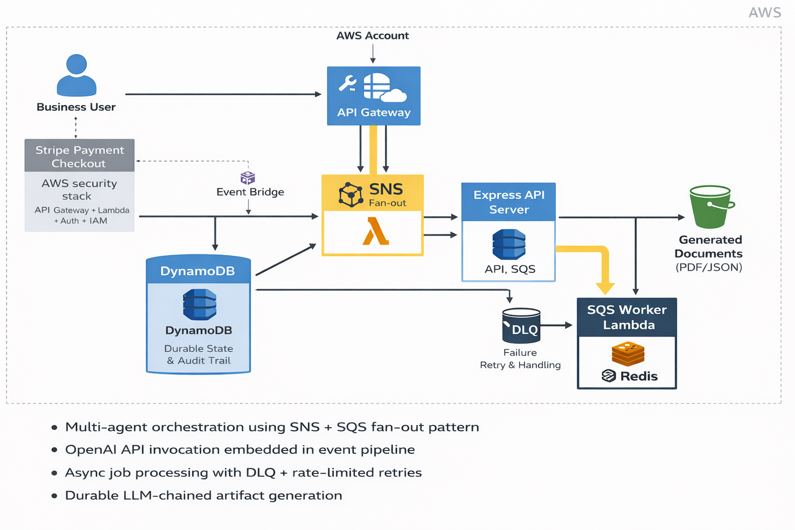
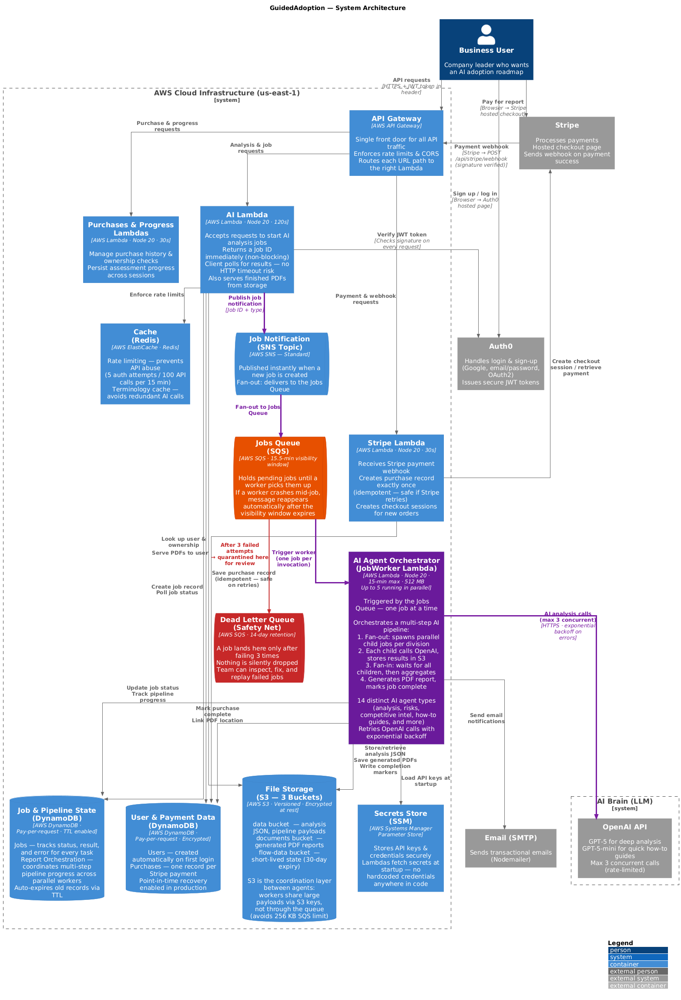

# Multi-Agent Event-Driven AI Orchestration Platform (AWS)

**[GuidedAdoption.ai](https://guidedadoption.ai)** is a SaaS product I designed and built for SMBs that want a practical path to adopting AI. A user enters their company details, selects one or two teams, and describes their pain points and goals. The system searches for relevant AI tools and workflows, then produces a personalized, up-to-9-week implementation guide with concrete how-to steps for getting each tool into production.

This repository documents the backend that powers it: a multi-tenant, event-driven orchestration platform built on AWS serverless primitives. When a user submits their analysis request, the system fans out to **14 parallel AI agents** (risk analysis, competitive intelligence, tool recommendations, implementation guides, and more), aggregates their outputs, and generates a durable PDF report all without a single synchronous LLM call blocking the API.

This is not a demo or proof-of-concept. It is a production system handling real users and real payments.

> **Sample output:** [View an AI Adoption Roadmap generated by the system](./AI-Roadmap-GuidedAdoption-ai-2026-02-22.pdf) GuidedAdoption.ai used as the demo customer.

---

## Table of Contents

| Section                                                       | What’s in it                                                       |
| ------------------------------------------------------------- | ------------------------------------------------------------------ |
| [What This Demonstrates](#what-this-demonstrates)             | High-level list of backend capabilities                            |
| [System Overview](#system-overview)                           | Two interaction modes: sync APIs vs. async agents                  |
| [Architecture Diagram](#architecture-highlight-diagram)       | High-level AWS flow diagram                                        |
| [Full Architecture Case Study](#full-architecture-case-study) | PDF deep-dive: design goals, tradeoffs, failure handling, security |
| [End-to-End Flow](#end-to-end-flow-interview-ready-summary)   | Step-by-step: auth → payment → job creation → agent execution      |
| [Reliability Model](#reliability-model)                       | Idempotency, failure isolation, backpressure, durable state        |
| [Cost and Throughput Control](#cost-and-throughput-control)   | How the system avoids runaway LLM spend                            |
| [Security Model](#security-model)                             | Auth0, IAM, Stripe HMAC, SSM, S3 access controls                   |
| [Observability Strategy](#observability-strategy)             | Per-job logging, queue depth, DLQ signals                          |
| [Key Architectural Tradeoffs](#key-architectural-tradeoffs)   | SNS+SQS vs Step Functions, polling vs WebSockets, S3 for artifacts |
| [Detailed Architecture](#detailed-architecture)               | Full C4 container diagram                                          |

---

## What This Demonstrates

- Multi-agent orchestration using SNS + SQS fan-out pattern
- Asynchronous job execution with bounded retries and DLQs
- Idempotent Stripe webhook handling and entitlement enforcement
- LLM invocation embedded inside distributed event pipelines
- Durable state and audit trails using DynamoDB + S3
- Redis-backed rate limiting to protect API and model usage
- Serverless architecture with controlled concurrency and backpressure

---

## System Overview

The system is designed around two interaction modes:

### 1. Synchronous APIs (User-Facing)

- Authentication (Auth0 JWT validation)
- Purchase creation (Stripe checkout)
- Job creation
- Progress polling

### 2. Asynchronous Agent Execution

- Event-driven fan-out on job creation
- SQS-based background processing
- Step-by-step agent execution
- Durable artifact persistence

---

## Architecture (Highlight Diagram)

This simplified diagram shows the core orchestration path: [View Detailed Diagram](#detailed-architecture)

Business User  
→ API Gateway  
→ SNS Fan-Out  
→ SQS Job Queue  
→ Worker Lambda  
→ OpenAI + S3  
→ Durable Artifacts

Supporting systems:

- DynamoDB (state + audit)
- Redis (rate limiting)
- DLQ (failure isolation)
- Stripe + Auth0 (identity + payments)

For the full C4 container-level architecture, see the detailed diagram and case study below.

---

## Full Architecture Case Study

Detailed write-up including:

- Design goals
- Key constraints
- End-to-end flows
- Failure handling strategy
- Idempotency model
- Backpressure mechanics
- Tradeoffs vs Step Functions
- Observability model
- Security posture

[View the Project Plan PDF](Architecture_Case_Study.pdf)

---

## End-to-End Flow (Interview-Ready Summary)

### Identity and Provisioning

1. Auth0 issues JWT
2. First authenticated request auto-provisions user in DynamoDB
3. User becomes anchor for purchases, jobs, and rate limits

### Payment and Entitlements

1. Checkout session created via Stripe
2. Stripe webhooks handled with signature verification
3. Idempotent purchase writes using `stripeSessionId`
4. Entitlements enforced at API layer

### Job Creation

1. User calls `/api/ai/*`
2. Job record created (`status = created`)
3. Orchestration state initialized
4. SNS publishes `JobCreated` event
5. Fan-out to SQS

### Agent Execution

1. Worker Lambda consumes messages (batch size = 1 for deterministic ordering)
2. Reads and writes artifacts from S3
3. Updates orchestration state in DynamoDB
4. Calls OpenAI API only for required steps
5. Retries transient failures
6. Hard failures go to DLQ for inspection and replay

---

## Reliability Model

This system is explicitly designed for at-least-once delivery.

### Idempotency

- Stripe webhook writes protected by conditional writes
- Job state transitions protected by deterministic step markers

### Failure Isolation

- SQS `maxReceiveCount` configured
- DLQ captures poison messages
- Manual re-drive supported

### Backpressure

- Queue depth absorbs burst traffic
- Lambda reserved concurrency caps cost
- Redis throttles LLM invocation

### Durable State

- DynamoDB stores orchestration metadata
- S3 stores immutable artifacts
- UI polls persisted state instead of coupling to workers

---

## Cost and Throughput Control

- Serverless model avoids idle compute cost
- Reserved concurrency limits runaway LLM spend
- Redis TTL-based counters for rate limiting
- S3 stores large artifacts cheaply while DynamoDB stores pointers only

---

## Security Model

- Auth0 JWT validation
- Least-privilege IAM roles per Lambda
- Stripe HMAC verification
- Secrets stored in SSM Parameter Store
- No public S3 access
- LLM inputs constrained to necessary fields

---

## Observability Strategy

Each job step logs:

- `jobId`
- `userId`
- `stepName`
- `duration`
- Model call metrics

Operational signals:

- Queue depth
- DLQ message count
- Lambda timeouts
- LLM latency anomalies
- Cost per job

---

## Key Architectural Tradeoffs

### Why SNS + SQS instead of Step Functions?

- Lower per-transition cost
- Easier replay semantics
- Clearer backpressure control

### Why poll for progress instead of WebSockets?

- Simpler client implementation
- Reduced operational surface area
- Can upgrade to push if needed

### Why S3 for artifacts?

- Large, immutable outputs
- Cheap and durable
- Keeps DynamoDB hot path small

---

## Walkthrough

Short architectural walkthrough (5 minutes):  
[Add your Loom or YouTube link]

---

## Positioning

This project demonstrates:

- Systems-level thinking
- Distributed workflow design
- Agentic AI orchestration
- Production-minded failure handling
- Cost-aware serverless architecture

It reflects how I design backend systems: async-first, failure-aware, and durable by default.

---

## Detailed Architecture

---

## Author

Eric Wozniak  
Backend Architect | Event-Driven Systems | LLM Orchestration  
https://www.linkedin.com/in/eric-wozniak-9a74b715b
